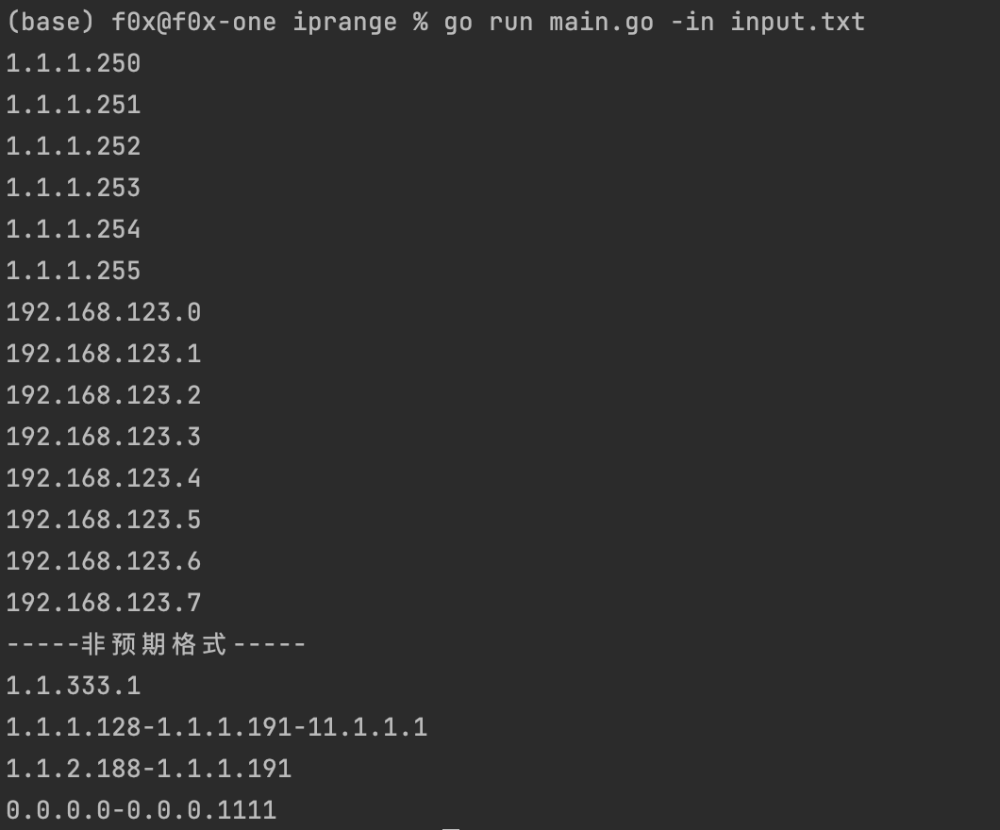

# iprange

计算ip范围,支持 cidr,ip-range 格式的输入

**✓支持的输入格式**
```
1.1.1.1-1.1.1.5
192.168.1.0/29
```

**❌错误的输入格式**
```
1.1.1.128-1.1.1.191-11.1.1.1
1.1.2.188-1.1.1.191
192.168.123.0/29-192.168.123.0/29
1.1.333.1
0.0.0.0-0.0.0.1111
```

**使用**
```
./main -in input.txt
```


